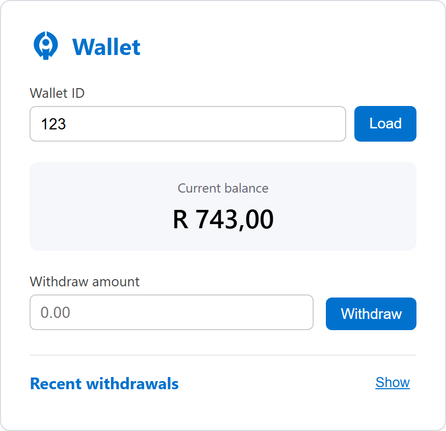
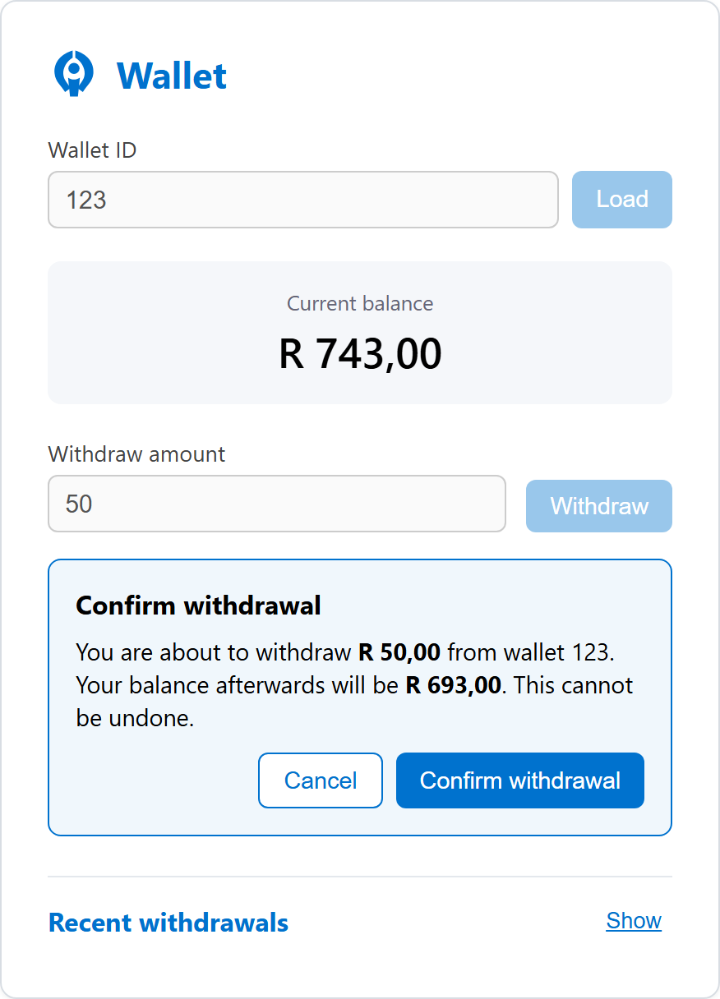
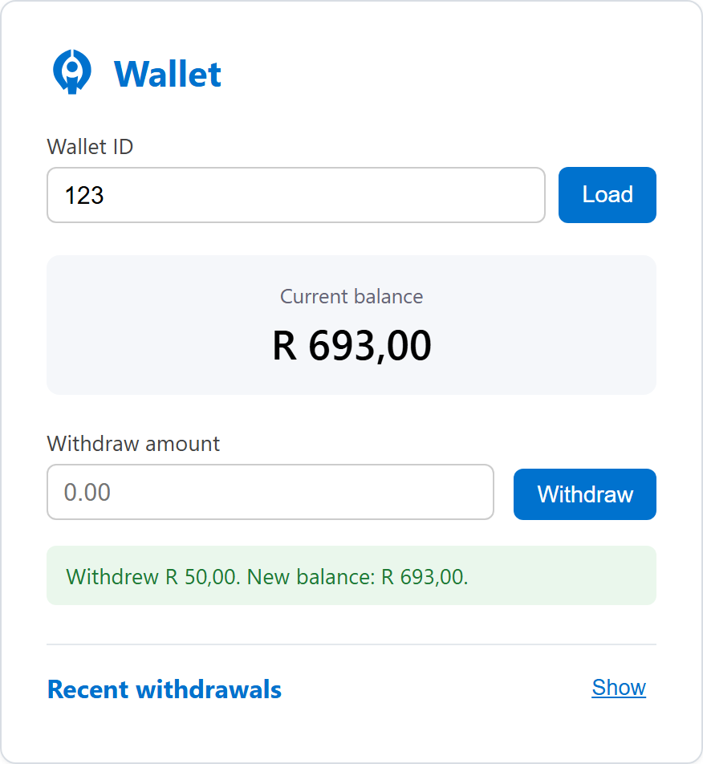
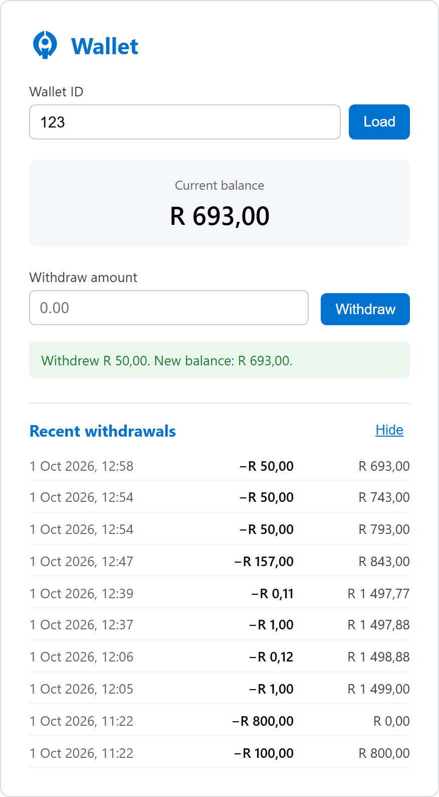
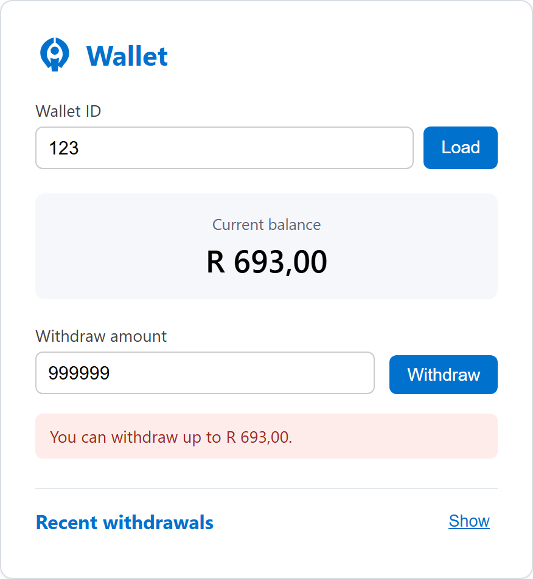
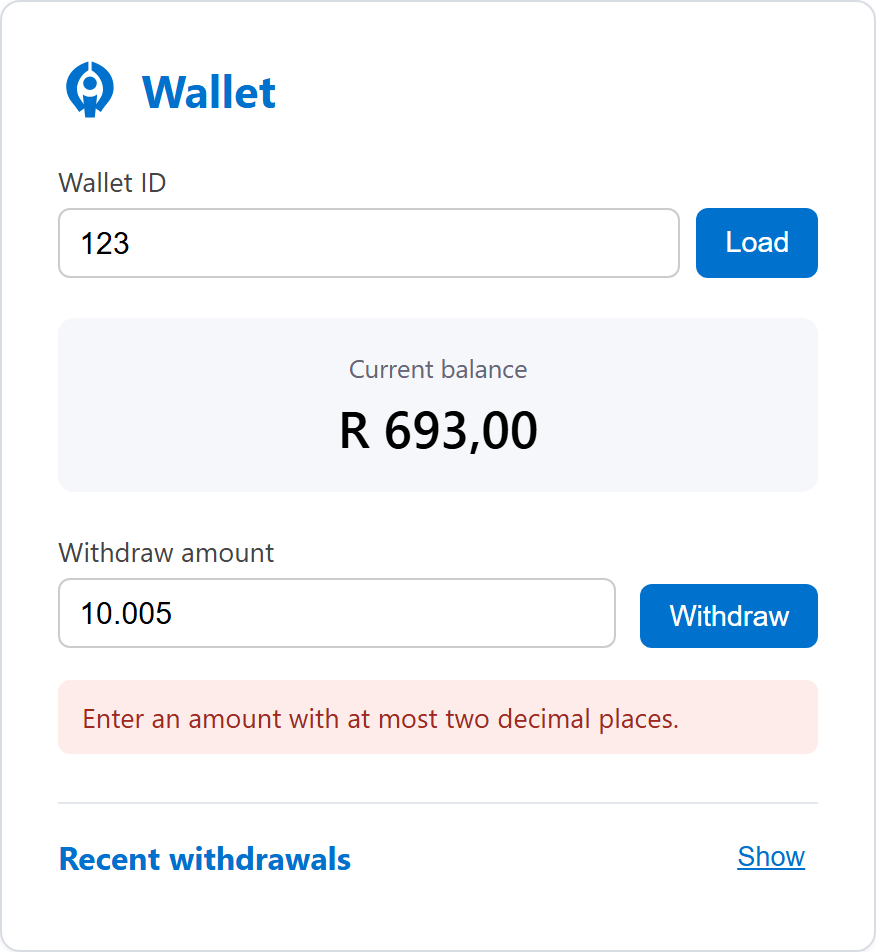
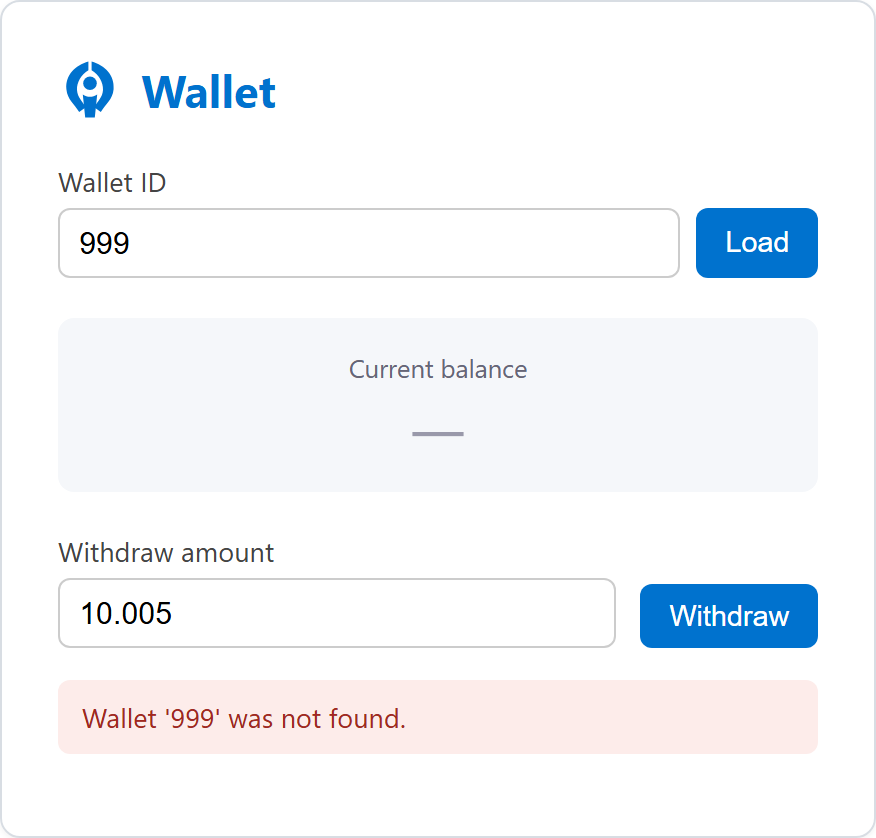
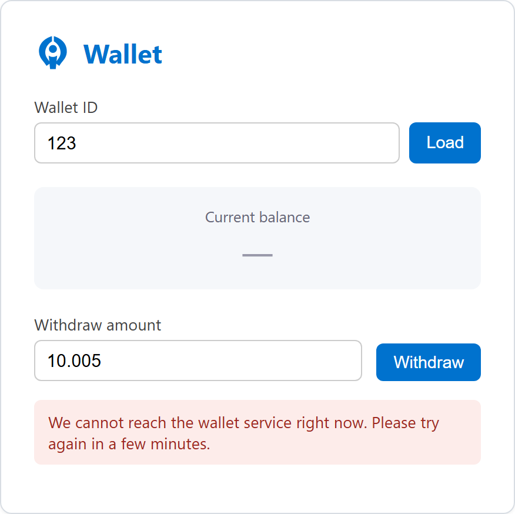
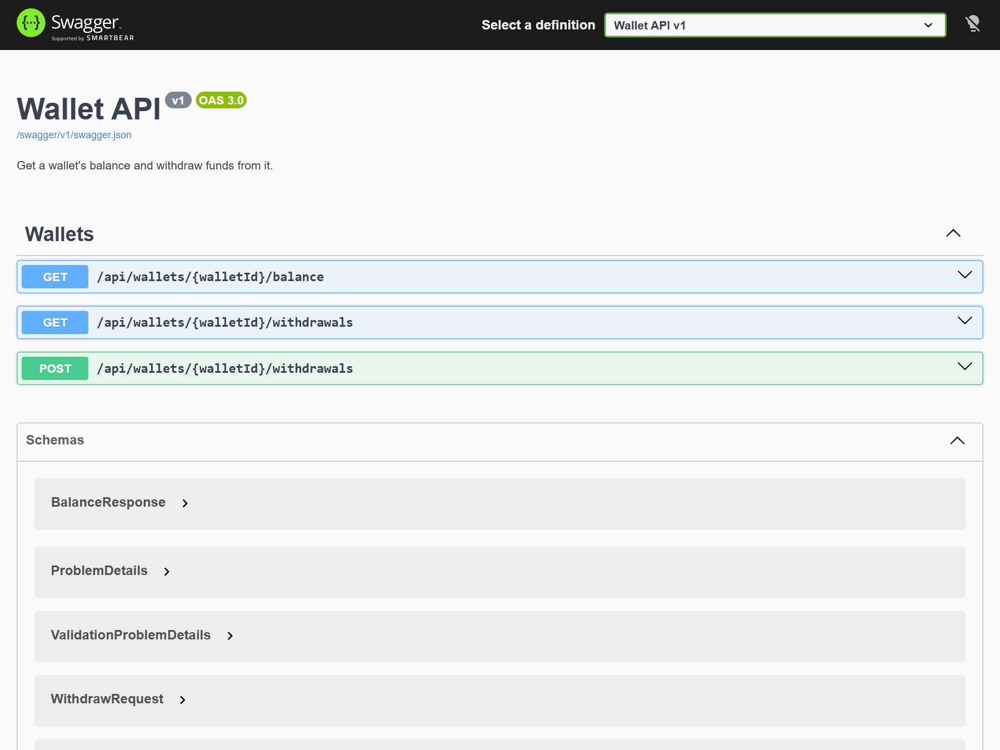

# Wallet

A small wallet service: check a balance, withdraw funds. Built as a take-home exercise, so the
scope is deliberately narrow — one wallet operation done properly rather than a handful done
half way.

Backend is ASP.NET Core (.NET 10) over SQL Server, with a small Angular app on top so there's
something to click on. The interesting part is really in `src/WalletApp.Domain` and
`src/WalletApp.Application` — that's where the "never go negative" rule lives and gets tested.

## What's here

```
src/
  WalletApp.Domain          Wallet aggregate, Money, withdrawal invariants, domain events/exceptions
  WalletApp.Application     Use cases (WalletService), ports (IWalletRepository, IWithdrawalEventBus)
  WalletApp.Infrastructure  EF Core + SQL Server, migrations, outbox dispatcher, RabbitMQ publisher/consumer
  WalletApp.Api             Controllers, Swagger, rate limiting, health checks, tracing, error mapping
tests/
  WalletApp.Domain.Tests        unit tests on Wallet and Money
  WalletApp.Application.Tests   WalletService against mocked ports (retries, idempotency, history)
  WalletApp.Api.Tests           full API against a real, disposable SQL Server database
client/
  wallet-ui                 Angular app: balance, withdraw (with confirmation), recent withdrawals
docs/
  architecture.md           diagrams (component view + withdrawal sequence)
.github/workflows/ci.yml    build and test on every push
```

## Running it locally

You need:
- .NET 10 SDK
- A SQL Server instance reachable at `localhost` with Windows authentication (this is what I
  built against — see [Assumptions](#assumptions) if that doesn't match your machine)
- RabbitMQ on `localhost:5672` with the default `guest`/`guest` login. It's optional: set
  `EventBus:Provider` to `Log` and events are written to the log instead, which is what the tests do.
- Node 20+ and npm, for the Angular client

**API**

```bash
dotnet run --project src/WalletApp.Api --launch-profile http
```

On startup the app applies any pending EF Core migrations and creates the database/tables if
they don't exist yet, then makes sure the seed wallet is there. Nothing manual required. It
listens on `http://localhost:5080`; Swagger UI is at `http://localhost:5080/swagger`.

If you want to manage the schema by hand instead:

```bash
dotnet ef database update --project src/WalletApp.Infrastructure --startup-project src/WalletApp.Infrastructure
```

**Client**

```bash
cd client/wallet-ui
npm install
npm start
```

Opens on `http://localhost:4200` and talks to the API at the URL in
`src/environments/environment.ts`. The API's CORS policy is scoped to that origin (see
`Cors:AllowedOrigins` in `appsettings.json`), so if you change the client's port, update both
sides.

**Tests**

```bash
dotnet test                       # backend: domain, application, API
cd client/wallet-ui && npx ng test --watch=false     # Angular
```

The API tests spin up a real, uniquely-named database on SQL Server per test class (migrated and
seeded the same way the app does at startup) and drop it afterwards. There's no mock database
standing in for it. Where that server is comes from `tests/WalletApp.Api.Tests/testsettings.json`
(local Windows-auth default); set `TestDatabase__MasterConnectionString` and
`TestDatabase__ConnectionStringTemplate` (with `{0}` where the database name goes) to point
elsewhere, which is how CI does it.

**CI**

`.github/workflows/ci.yml` runs on every push and pull request. One job builds the solution and
runs `dotnet test` against a SQL Server service container; another runs the Angular tests and a
production build.

## Screenshots

Captured from the running app against the seeded wallet (123).

### Withdrawing

| Balance on load | Confirm step |
| --- | --- |
|  |  |

A withdrawal is never sent straight away: the UI shows the amount and the balance afterwards and waits for a confirmation.



### Recent withdrawals

The list is hidden by default and opens with the Show/Hide toggle. Newest first, with the balance after each withdrawal.



### Errors

| Insufficient funds | More than two decimal places |
| --- | --- |
|  |  |

| Wallet not found | Service unreachable |
| --- | --- |
|  |  |

When the service can't be reached (or answers 429/5xx) the pending withdrawal is kept, so a retry reuses the same `Idempotency-Key` and can't double-spend.

### Swagger



## Configuration

Nothing environment-specific is baked into the code, and the option classes carry no defaults of
their own. Every value lives in `src/WalletApp.Api/appsettings.json`:

| Section | Purpose |
|---|---|
| `ConnectionStrings:WalletDb` | SQL Server connection string |
| `Cors:AllowedOrigins` | which origins the API accepts browser requests from |
| `WalletSeed` | the id/owner/balance/currency of the wallet created on first run |
| `Withdrawal` | concurrency retry budget, longest idempotency key, default and maximum history page size |
| `Outbox` | whether the background relay runs, poll interval and batch size |
| `EventBus:Provider` | `RabbitMq` or `Log` |
| `RabbitMq` | host, port, credentials, virtual host, exchange, routing key, queue |
| `RateLimiting` | on/off, read and write requests allowed per client per window, window length |
| `Telemetry` | tracing on/off, service name, exporter (`Console`, `Otlp` or `None`), OTLP endpoint |
| `Logging:Console` | JSON log formatter and its options |

The Angular client has its own `src/environments` files (API URL, default wallet id, locale,
refresh interval, history page size).

## API

Everything is under `/api/wallets/{walletId}`, where `walletId` is a plain integer (the seed
wallet is `123`, starting at ZAR 1,000.00, matching the example in the brief) rather than a GUID
— easier to read, type, and put in a URL for a small demo like this one. See the trade-off note
below on why that's not free.

- `GET /balance` → `{ walletId, balance, currency }`
- `POST /withdrawals` with `{ amount }` (and optionally `currency`, which must match the
  wallet's) → `{ withdrawalId, walletId, amount, balanceAfter, currency, occurredAtUtc, replayed }`.
  Takes an optional `Idempotency-Key` header, see below.
- `GET /withdrawals?limit=` → the wallet's recent withdrawals, newest first. `limit` defaults to
  20 and can't exceed 100 (both set in `Withdrawal` config).

**Idempotency.** Send an `Idempotency-Key` header (1–100 characters) with a withdrawal and a
retry of the same request returns the original result instead of taking the money again. A replay
is marked with an `Idempotent-Replayed: true` response header. The key is scoped to the wallet,
and reusing it with a different amount or currency is rejected with a 422. Without the header the
endpoint behaves as before, so existing callers are unaffected.

**Health.** `GET /health/live` says the process is up. `GET /health/ready` also checks it can
reach the database. Both are exempt from rate limiting.

Errors come back as [RFC 7807](https://www.rfc-editor.org/rfc/rfc7807) problem details:

| Situation | Status |
|---|---|
| Wallet doesn't exist | 404 |
| Amount ≤ 0, bad currency code, bad `limit`, bad idempotency key, or fails model validation | 400 |
| Amount exceeds balance | 409 |
| Idempotency key reused with a different request | 422 |
| Too many requests from one client | 429, with `Retry-After` |
| Concurrency conflict not resolved after retrying | 503 |

Server-side failures return a plain message plus a reference id; the technical detail goes to the
log under that id.

Full schema is in Swagger at `/swagger`.

## Design notes

**Where the invariant actually lives.** `Wallet.Withdraw()` is the only way a wallet's balance
changes. It checks the amount is positive, checks funds are sufficient, and only then mutates
the balance — all inside the aggregate, not in a service or a SQL constraint. That means the
"never negative" rule holds no matter what calls it, and it's trivial to unit test without a
database (see `WalletTests.cs`). Amounts and currencies travel together as a `Money` value, so
mixing currencies or sneaking in a third decimal place fails loudly instead of being rounded away.

**Withdrawal succeeds → balance changes → event exists, all three or none.** The withdrawal
event row (`WithdrawalEvents` table) is written in the *same* `SaveChanges` call as the balance
update, so they commit or roll back together. I didn't want "the money moved but no event was
recorded" to be possible, even under a crash between the two writes.

**Getting the event out: transactional outbox.** That same table doubles as the outbox. Each row
starts with no `DispatchedAtUtc`; `OutboxDispatcher`, a background service, polls for undelivered
rows, publishes them in order to RabbitMQ (a durable topic exchange, `wallet.events`) and stamps
them once the broker has accepted them. If the broker is down the rows just wait and go out when
it comes back. Delivery is at-least-once, so a subscriber has to tolerate the odd duplicate; the
event id is the thing to dedupe on. `RabbitMqWithdrawalEventConsumer` is a small example
subscriber that reads the queue and logs each event. The withdrawal request itself never talks to
the broker, so a broker outage can't fail a withdrawal.

**Idempotency.** The key is stored on the event row, behind a unique filtered index on
`(WalletId, IdempotencyKey)`. A repeat finds the earlier row and returns its result without
touching the balance. If two requests with the same key race, one of them loses at the index; it
catches that, retries, and replays the winner's result. The test suite fires ten parallel
requests with one key and checks exactly one withdrawal happened. The Angular client generates a
key when you open the confirmation panel and keeps it if a request fails in a way that leaves the
outcome unknown (timeout, 5xx, 429), so pressing Confirm again can't withdraw twice.

**Concurrency: optimistic, with a retry loop, over a real database.** `Wallet.Version` is an EF
Core concurrency token. Two concurrent withdrawals against the same wallet will not both apply —
the second one's `UPDATE ... WHERE Version = @loaded` affects zero rows, EF throws
`DbUpdateConcurrencyException`, and `WalletService` catches that, reloads the wallet, and retries
the whole operation against the fresh balance. `tests/WalletApp.Api.Tests/WithdrawalConcurrencyTests.cs`
fires 20 concurrent withdrawal requests at a wallet with only enough balance for 5, against the
real API and a real database, and asserts exactly 5 succeed and the final balance is precisely
zero — not close to zero, not negative.

I originally built this against SQLite for a zero-install local setup, and hit exactly the
locking behaviour you'd expect from a single-writer embedded database under concurrent requests.
Rather than paper over that with pragmas, I moved to the SQL Server instance already running on
this machine, which handles row-level locking properly and made the concurrency test both
correct and fast. It also meant switching from `EnsureCreated` to real EF Core migrations
(`src/WalletApp.Infrastructure/Persistence/Migrations`), which is the right call anyway — schema
changes should be reviewable, not implicit.

One bug this caught, worth mentioning because it wasn't obvious going in: `WalletDbContext` is
scoped per request, and EF's identity map means a second `GetByIdAsync` call *within that same
context* was returning the same, already-mutated in-memory `Wallet` instead of a fresh read —
so the retry loop was silently retrying against stale data instead of the current row. Fixed by
explicitly reloading the tracked entity (and detaching the failed event insert) on a concurrency
conflict, in `EfWalletRepository.SaveWithdrawalAsync`. The concurrency test is what surfaced it —
it failed with a suspiciously small success count before the fix.

**Operational bits.** Requests are rate limited per client address, with separate budgets for
reads and writes (`RateLimiting`); the health endpoints are exempt so probes keep working while a
client is being throttled. Logs are JSON on the console. Tracing uses OpenTelemetry: incoming
requests, SQL calls, and a span around each outbox publish. Where spans go is a config choice
(`Telemetry:Exporter`); out of the box they aren't exported anywhere.

**Layering.** Domain has no dependencies on anything. Application depends only on Domain and
defines the ports (`IWalletRepository`, `IWithdrawalEventBus`) it needs; it's tested entirely
with mocks, no database involved. Infrastructure implements those ports against EF Core /
SQL Server and RabbitMQ. Api wires it all together and is the only layer that knows about HTTP.

## Assumptions

- **A wallet already exists.** The brief says a creation endpoint isn't required, so the app
  guarantees one wallet on startup (id, owner, balance, currency all configurable in
  `appsettings.json`, not hard-coded). There's no way to create additional wallets through the
  API — that's intentionally out of scope.
- **SQL Server on localhost, Windows auth.** That's what's on this machine, so that's what I
  built and tested against. If you're running this somewhere else, change
  `ConnectionStrings:WalletDb` (e.g. to a SQL login, or to a `(localdb)\MSSQLLocalDB` instance).
- **RabbitMQ on localhost with the default guest login**, or switch the provider to `Log`.
- **The client knows the wallet id out of band.** There's no "list wallets" endpoint (matches
  "no wallet creation" in scope), so the Angular app just defaults to the seeded wallet's id from
  its own environment config, with an input if you want to query a different (or non-existent, to
  see the 404 path) id.
- **Currency is a three-letter code with no conversion.** `Money` keeps amount and currency
  together and refuses to mix them, but there's no FX, per the brief.
- **No auth.** Also explicitly out of scope. Anyone who can reach the API and knows a wallet id
  can withdraw from it — see limitations below.

## Trade-offs

- **SQL Server over SQLite/in-memory providers** — heavier to set up than an embedded database,
  but it's what made the concurrency behaviour (and the concurrency test) actually meaningful
  instead of hand-waved.
- **A real broker, but a simple relay.** Polling the outbox table is easy to reason about and
  needs no extra moving parts beyond RabbitMQ, at the cost of up to a poll interval of latency
  and at-least-once (not exactly-once) delivery. Change-data-capture or a transactional
  broker integration would cut the latency; I didn't think it earned its complexity here.
- **Optimistic concurrency + retries over pessimistic locking.** Simpler, and fine for what's
  presumably light contention on any one wallet in practice. The retry budget
  (`Withdrawal:MaxConcurrencyRetries`, 25 in `appsettings.json`) is generous enough to resolve a
  20-way burst in tests; a real system would probably use a smaller server-side budget plus a
  `503` + `Retry-After` and let the client back off, rather than holding the request open through
  a long retry chain.
- **Idempotency is opt-in.** Making the header mandatory would be safer, but it would break any
  caller that doesn't know about it. Keys also live as long as the event row, with no expiry.
- **In-memory rate limiting.** The built-in limiter keeps its counters in the process, so with
  several API instances each would enforce its own limit. Fine for one instance; a shared store
  would be needed beyond that. It also keys on the client address, so everyone behind one proxy
  shares a budget.
- **Swagger always on, not gated to `Development`.** Convenient for this exercise; I'd restrict
  or remove it in a real deployment.
- **Short integer wallet ids over GUIDs.** Started with GUIDs (the usual choice when you don't
  want ids to be guessable or enumerable), then switched to a plain `int` because typing/copying
  `11111111-1111-1111-1111-111111111111` around while testing was needless friction for a
  single-wallet demo. The real cost of that switch: combined with "no auth" below, a short
  sequential id is trivially guessable/enumerable, which a GUID would have at least made
  impractical. Worth reverting to GUIDs (or adding auth) before this is anything but a demo.

## Known limitations

- No authentication/authorization at all — out of scope per the brief, but worth being explicit
  that this is not close to production-shaped as-is. Combined with short integer wallet ids (see
  trade-offs), wallet ids are also easy to guess/enumerate — a GUID plus auth would be the
  realistic combination, not GUID alone or auth alone.
- Event delivery is at-least-once, so anything consuming the queue must handle duplicates. The
  example consumer only logs, so it doesn't.
- The rate limiter is per process and per client address (see trade-offs), and idempotency is
  opt-in.
- The history endpoint returns the latest N withdrawals only, with no paging cursor or date
  filter.
- The Angular client is still small: one wallet at a time, no routing, no component library,
  and only component/service-level tests with no end-to-end run in a real browser. It does now
  confirm before withdrawing, send an idempotency key, show recent withdrawals and refresh the
  balance every few seconds.
- Traces aren't exported unless you configure an exporter, and there are no metrics.

## Potential improvements

- JWT-based auth with wallet ownership checks.
- A shared store (Redis, say) behind the rate limiter, and per-user rather than per-address limits.
- Idempotency key expiry, and making the header required.
- Cursor-based paging and date filters on the withdrawal history.
- Consumer-side deduplication on the event id, plus a dead-letter queue for events that keep failing.
- Metrics (request rates, outbox lag) alongside the existing traces.
- Browser-level end-to-end tests for the Angular app.
- Containerise the API and its dependencies with a `docker-compose.yml` so a reviewer can start
  everything with one command.

## AI usage

Thabang Sibanyoni did the design and made the decisions on this project. Claude (Anthropic's AI
assistant) helped with the implementation, working from the instructions and commands Thabang
gave it, and the work was reviewed and run locally before being committed.
