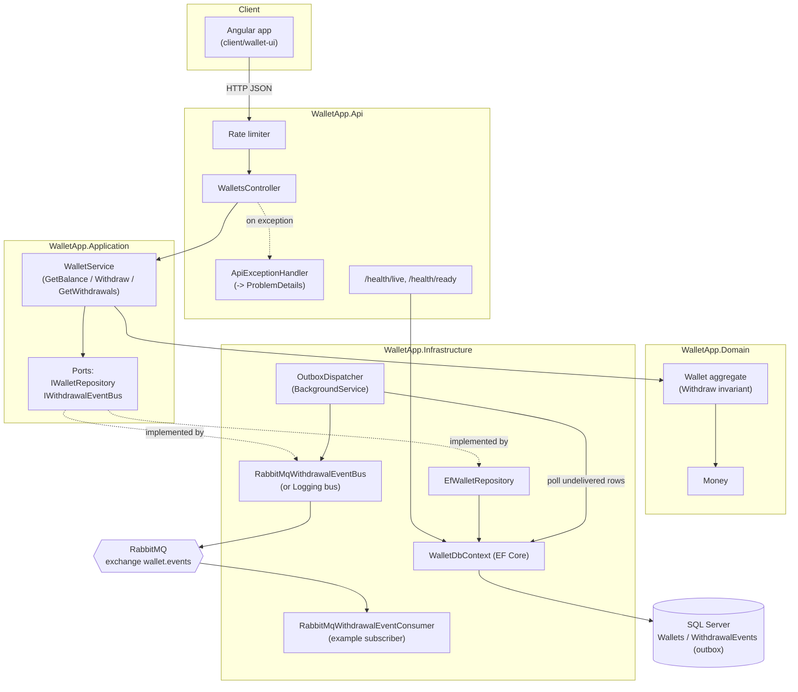
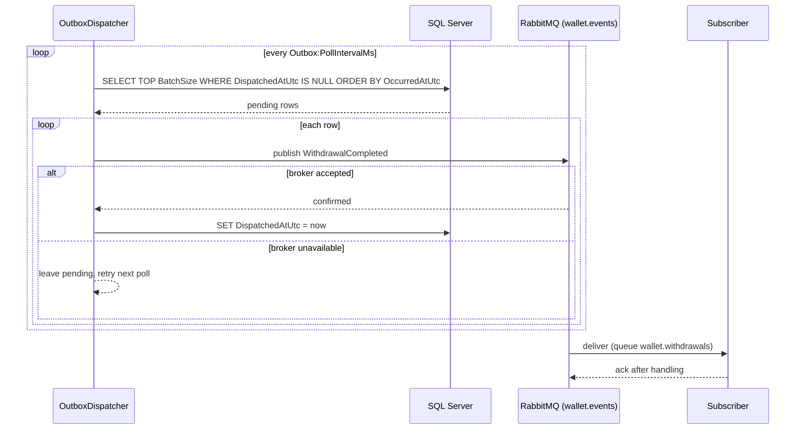

# Architecture

## Components

Domain has zero dependencies. Application depends only on Domain and defines the ports it needs.
Infrastructure and Api both implement/consume those ports — Api never talks to EF Core directly,
and Infrastructure never talks to HTTP.



## Withdrawal sequence

The balance update and the event row are written in the *same* `SaveChanges` call — one
transaction, so "money moved" and "event recorded" can't disagree. The event row is also the
outbox: a background dispatcher relays it to RabbitMQ afterwards, so the request never waits on
the broker. If the request carries an `Idempotency-Key` that has already been used, the stored
result is returned and nothing is written.

```mermaid
sequenceDiagram
    participant C as Client
    participant Ctrl as WalletsController
    participant Svc as WalletService
    participant W as Wallet (aggregate)
    participant Repo as EfWalletRepository
    participant DB as SQL Server

    C->>Ctrl: POST /wallets/{id}/withdrawals { amount }<br/>Idempotency-Key: k
    Ctrl->>Svc: WithdrawAsync(id, amount, key)
    Svc->>Repo: GetByIdAsync(id)
    Repo->>DB: SELECT wallet WHERE Id = @id
    DB-->>Repo: wallet row (incl. Version)
    Repo-->>Svc: Wallet

    opt key supplied
        Svc->>Repo: FindWithdrawalByKeyAsync(id, key)
        Repo->>DB: SELECT event WHERE WalletId, IdempotencyKey
    end

    alt key already used, same amount and currency
        Svc-->>Ctrl: stored result (replayed)
        Ctrl-->>C: 200 + Idempotent-Replayed: true
    else key already used, different request
        Svc-->>Ctrl: throws IdempotencyKeyReuseException
        Ctrl-->>C: 422 ProblemDetails
    else new withdrawal
        Svc->>W: Withdraw(amount)
        alt amount <= 0
            W-->>Svc: throws ArgumentOutOfRangeException
            Ctrl-->>C: 400 ProblemDetails
        else amount > balance
            W-->>Svc: throws InsufficientFundsException
            Ctrl-->>C: 409 ProblemDetails
        else sufficient funds
            W-->>Svc: WithdrawalCompleted event (balance mutated in memory)

            Svc->>Repo: SaveWithdrawalAsync(wallet, event)
            Repo->>DB: UPDATE Wallets SET Balance=.., Version=..<br/>WHERE Id=@id AND Version=@loaded
            Repo->>DB: INSERT INTO WithdrawalEvents (..., IdempotencyKey)
            Note over Repo,DB: both in one transaction

            alt committed
                DB-->>Repo: success
                Repo-->>Svc: OK
                Svc-->>Ctrl: WithdrawResult
                Ctrl-->>C: 200 { balanceAfter, ... }
            else another request updated Version first
                DB-->>Repo: 0 rows affected
                Repo->>Repo: reload wallet, detach the failed event insert
                Repo-->>Svc: throws ConcurrencyConflictException
                Svc->>Svc: retry from GetByIdAsync<br/>up to Withdrawal:MaxConcurrencyRetries
            else same key won a race (unique index)
                DB-->>Repo: duplicate key error
                Repo-->>Svc: throws DuplicateIdempotencyKeyException
                Svc->>Svc: retry; next pass finds the key and replays
            end
        end
    end
```

## Event delivery (outbox)

Runs independently of requests. Rows are published in the order they happened and only stamped
once the broker has accepted them, so a broker outage delays events but never loses them.
Delivery is at-least-once.


