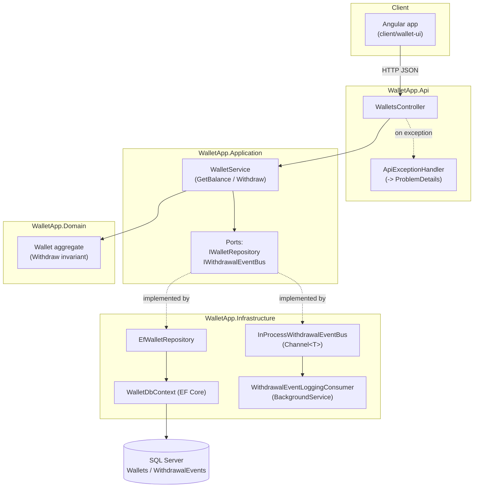
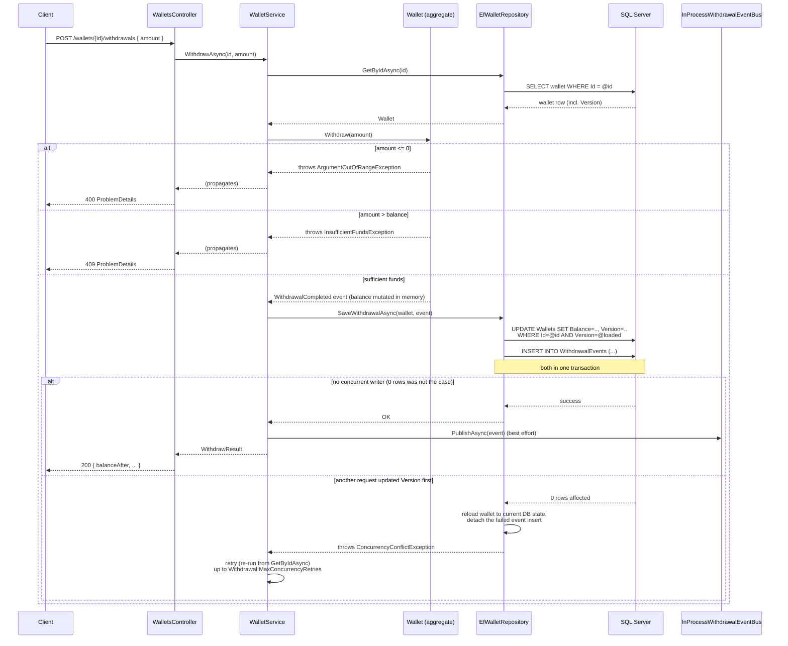

# Architecture

## Components

Domain has zero dependencies. Application depends only on Domain and defines the ports it needs.
Infrastructure and Api both implement/consume those ports — Api never talks to EF Core directly,
and Infrastructure never talks to HTTP.

## Withdrawal sequence

The durable event write and the balance update happen in the *same* `SaveChanges` call — one
transaction, so "money moved" and "event recorded" can't disagree. The live event-bus publish
happens only after that transaction has already committed, and is best-effort.

